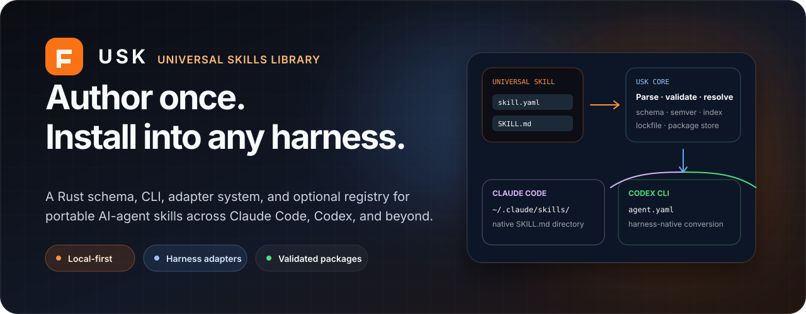

<p align="center">
  
</p>

<p align="center">
  <a href="#quick-start-from-source"><strong>Quick start</strong></a>
  &nbsp;&nbsp;·&nbsp;&nbsp;
  <a href="#how-portability-works"><strong>Architecture</strong></a>
  &nbsp;&nbsp;·&nbsp;&nbsp;
  <a href="#cli-surface"><strong>CLI</strong></a>
  &nbsp;&nbsp;·&nbsp;&nbsp;
  <a href="spec/SKILL_SPEC.md"><strong>Skill specification</strong></a>
  &nbsp;&nbsp;·&nbsp;&nbsp;
  <a href="#self-hosted-registry-optional"><strong>Registry</strong></a>
</p>

<p align="center">
  <a href="LICENSE"></a>
  
  
  
  
</p>

<p align="center">
  <strong>Write a skill once. Validate it once. Install it into the agent harness that needs it.</strong><br />
  USK is a Rust schema, CLI, adapter system, and optional registry for reusable AI-agent skills that should survive the rise and fall of individual frameworks.
</p>

> [!IMPORTANT]
> USK is currently distributed from source. The repository does not yet publish crates or prebuilt binaries, and the former `usk.dev/install.sh` path is not active. The current Cargo package installs the executable as `usk-cli`; a future distribution release can expose the shorter `usk` binary name.

## Recruiter quick scan

| | |
| --- | --- |
| **What I built** | A harness-agnostic packaging and distribution layer for AI-agent skills: canonical schema, parser, validator, lockfile, local store, search index, CLI, adapters, integration tests, and an optional self-hosted registry. |
| **My role** | Product definition, package specification, Rust workspace architecture, CLI and adapter design, registry semantics, validation model, testing, and open-source documentation. |
| **Core challenge** | Preserve reusable operating methods across incompatible agent harnesses without reducing them to copy-pasted prompts or coupling authors to one vendor's filesystem format. |
| **Primary journey** | Author `skill.yaml` + `SKILL.md` → inspect and validate → convert or install → write directly to the harness-native location. |
| **Supported adapters** | Claude Code skill directories and Codex `agent.yaml` output. |
| **Stack** | Rust 2021, Clap, Serde, Axum, Tokio, Reqwest, Git2, SemVer, tar/gzip, filesystem store, integration-test crate. |

## Why a universal skills layer

Agent harnesses increasingly support reusable instructions, examples, templates, scripts, and references—but each harness defines its own discovery paths and package conventions.

Without a portability layer, teams repeatedly rewrite the same methods:

- incident escalation;
- sales-call preparation;
- code review and remediation;
- deployment verification;
- research and evidence gathering;
- domain-specific operating procedures.

USK separates the **method** from the **harness projection**:

<table>
  <tr>
    <td width="50%" valign="top">
      <h3>Universal package</h3>
      One canonical manifest, instruction body, examples, templates, scripts, references, compatibility metadata, and semantic version.
    </td>
    <td width="50%" valign="top">
      <h3>Harness-native projection</h3>
      A pluggable adapter converts that package into the exact path and format consumed by Claude Code, Codex, or a future harness.
    </td>
  </tr>
</table>

The objective is not to invent a lowest-common-denominator prompt file. It is to preserve rich, testable working methods while isolating framework-specific installation details.

## Quick start from source

Requirements:

- Rust and Cargo;
- Git;
- a supported agent harness if you want to install the converted skill into its native location.

```bash
git clone https://github.com/joyboy257/usk.git
cd usk

cargo install --path crates/usk-cli
```

The installed executable is currently named `usk-cli`.

```bash
# Inspect and validate an included example skill
usk-cli inspect spec/examples/escalation-handling
usk-cli validate spec/examples/escalation-handling

# Preview a harness conversion without installing it
usk-cli convert spec/examples/escalation-handling \
  --harness claude-code \
  --out /tmp/escalation-preview

# Install directly into Claude Code's native skills directory
usk-cli install ./spec/examples/escalation-handling \
  --harness claude-code
```

For Claude Code, the adapter writes to the harness-native skill path, such as:

```text
~/.claude/skills/escalation-handling/
```

No registry server is required for local directories or supported URL sources.

## Anatomy of a skill

```text
my-skill/
├── skill.yaml             # Manifest and metadata — required
├── SKILL.md               # Main operating instructions — required
├── instructions/          # Focused sub-step instructions — optional
├── examples/              # Input/output examples — optional
├── templates/             # Reusable output templates — optional
├── scripts/               # Executable helpers — optional
└── references/            # Supporting documentation — optional
```

The canonical format is documented in [`spec/SKILL_SPEC.md`](spec/SKILL_SPEC.md). Complete examples are available under [`spec/examples/`](spec/examples/):

- [`escalation-handling`](spec/examples/escalation-handling/)
- [`sales-call-prep`](spec/examples/sales-call-prep/)

A skill package can declare metadata, semantic version, authorship, tags, supported harnesses, compatibility ranges, entry points, and included resources.

## How portability works

```text
Universal skill directory
  skill.yaml · SKILL.md · examples · templates · scripts · references
                              │
                              ▼
                         usk-core
       parse · validate · resolve · index · lockfile · package store
                              │
                              ▼
                    HarnessAdapter contract
                    discovery · paths · conversion
                              │
              ┌───────────────┴───────────────┐
              ▼                               ▼
     Claude Code adapter                 Codex adapter
     native skill directory              agent.yaml output
```

### Core package model

`usk-core` owns:

- schema and typed package structures;
- manifest and Markdown parsing;
- structural validation;
- compatibility and semantic-version resolution;
- search-index primitives;
- configuration and local package-store paths;
- installed-skill lockfile state.

### Adapter contract

`usk-harness-core` defines the shared adapter interface and harness discovery registry. Each adapter receives a parsed, validated skill plus a destination and emits the harness-specific projection.

Adding another harness is intentionally bounded:

1. implement the adapter contract;
2. define native discovery and target paths;
3. register the adapter in known harness discovery;
4. add conversion and integration tests;
5. document any features that cannot be represented safely.

### Local-first installation

The default path is deliberately serverless:

```text
local folder or URL
        │
        ▼
parse and validate package
        │
        ▼
select harness adapter
        │
        ▼
write to harness-native destination
        │
        ▼
record installed version and projection state
```

This makes USK useful for individuals and repositories before a shared registry exists.

## Supported harnesses

| Harness | Adapter crate | Current projection |
| --- | --- | --- |
| Claude Code | [`usk-harness-claude`](crates/usk-harness-claude/) | Native `SKILL.md` directory structure |
| Codex | [`usk-harness-codex`](crates/usk-harness-codex/) | `agent.yaml` conversion |

The adapter architecture is the product boundary. Support for future harnesses should extend this layer rather than fork the skill schema.

## CLI surface

The current source-built executable is `usk-cli`.

| Command | Purpose |
| --- | --- |
| `new <name>` | Scaffold a new skill package. |
| `inspect <path>` | Show parsed metadata, files, and package sizes. |
| `read <path> <file>` | Print one file from a skill directory. |
| `validate <path>` | Run structural package validation. |
| `convert <path> --harness <name> --out <dir>` | Preview a harness-specific projection. |
| `install <name-or-path-or-url> [--harness <name>] [--target <path>]` | Install from a registry, local directory, or URL. |
| `install ... --locked` | Reproduce installation from `usk.lock`. |
| `list` | List installed skills. |
| `status` | Show installed skills and enabled/disabled projection state. |
| `enable <name>` | Re-create a disabled harness projection. |
| `disable <name>` | Remove the projection while preserving the stored package. |
| `update [name]` | Update one or all installed skills. |
| `outdated` | List installed skills with available versions. |
| `harness add\|remove\|list` | Manage harness adapters. |
| `publish [path]` | Validate and publish to a configured registry. |
| `search <query>` | Search a configured registry. |
| `doctor` | Diagnose paths, writability, installed state, and lockfile health. |

Run the full help directly from the workspace:

```bash
cargo run -p usk-cli -- --help
cargo run -p usk-cli -- install --help
```

## Self-hosted registry — optional

USK includes an Axum registry for teams that need versioned, shared skill distribution. Most local installs do not need it.

```bash
cargo run -p usk-server
# listens on 0.0.0.0:8080 by default
```

Configure the CLI through `~/.usk/config.toml` or the CLI configuration surface before using name-based registry operations.

The registry provides:

- versioned publish and install routes;
- immutable published versions;
- per-`(name, version)` locking to prevent concurrent torn publishes;
- filesystem package storage;
- a Git commit for each accepted publish;
- a rebuildable search index;
- tarball retrieval and adapter-based consumer installation.

```text
author                     registry                         consumer
  │                           │                                │
  │ publish validated skill   │                                │
  ├──────────────────────────▶│ lock · store · git commit      │
  │                           │ update index                   │
  │                           │                                │
  │                           │◀──────────── search ────────────┤
  │                           │──────── metadata/results ─────▶│
  │                           │◀────────── install ─────────────┤
  │                           │──────── package archive ──────▶│
  │                           │             adapter conversion │
```

Read [`docs/ARCHITECTURE.md`](docs/ARCHITECTURE.md) for route, storage, and data-flow details.

## Rust workspace

```text
usk/
├── crates/
│   ├── usk-core/               # Schema, parser, validation, resolver, store
│   ├── usk-harness-core/       # Adapter contract, discovery, native paths
│   ├── usk-harness-claude/     # Claude Code conversion
│   ├── usk-harness-codex/      # Codex conversion
│   ├── usk-cli/                # User-facing command-line tool
│   ├── usk-server/             # Optional Axum registry
│   └── usk-integration-tests/  # Cross-crate end-to-end tests
├── spec/                       # Canonical specification and examples
├── docs/                       # Architecture and development docs
└── scripts/install.sh          # Source-tree installer helper
```

All workspace crates currently share version `0.1.0`. The CLI and integration-test crates are explicitly marked `publish = false`, and public crate publication has not yet been completed.

## Verification and development

```bash
cargo fmt --all -- --check
cargo clippy --workspace --all-targets -- -D warnings
cargo test --workspace
```

Useful focused commands:

```bash
cargo test -p usk-core
cargo test -p usk-integration-tests
cargo run -p usk-cli -- doctor
cargo run -p usk-cli -- validate spec/examples/escalation-handling
```

Development guidance lives in [`docs/DEVELOPMENT.md`](docs/DEVELOPMENT.md).

> [!NOTE]
> The integration crate expects prebuilt `usk-cli` and `usk-server` binaries, so run `cargo build --workspace --bins` before its end-to-end tests. At the time of this README update, the functional suites completed 119 unit tests and 4 integration tests, but the repository still has pre-existing `rustfmt` drift, one Clippy boolean-assert warning under `-D warnings`, and an intermittent temporary-directory failure in the collection-install test that passed when rerun in isolation.

## Current status

| Area | Status |
| --- | --- |
| Universal skill specification and examples | **Present** |
| Parser, validator, resolver, store, index, and lockfile | **Implemented** |
| CLI authoring, inspection, conversion, install, and lifecycle commands | **Implemented** |
| Claude Code and Codex adapters | **Implemented** |
| Optional Axum registry and Git audit trail | **Implemented** |
| Cross-crate integration-test package | **Present** |
| Public crates.io publication | **Not currently published** |
| Public prebuilt binary installer | **Not currently available** |
| Short `usk` executable name | **CLI display name only; installed binary is currently `usk-cli`** |

The next distribution milestone is packaging polish: explicit binary naming, release artifacts, checksums and provenance, a working installer endpoint, crate metadata, and repeatable installation tests across supported platforms.

## What this project demonstrates

- Rust workspace and crate-boundary design;
- portable package schema and semantic-version reasoning;
- CLI ergonomics and lifecycle management;
- plugin/adapter architecture for changing external frameworks;
- filesystem, lockfile, and package-store design;
- immutable registry semantics and concurrency control;
- Git-backed audit history;
- truthful open-source distribution and documentation discipline.

## Contributing

New harness adapters, validation improvements, CLI fixes, package examples, and documentation are welcome. Read [`CONTRIBUTING.md`](CONTRIBUTING.md) and [`docs/DEVELOPMENT.md`](docs/DEVELOPMENT.md).

## Security

Report vulnerabilities according to [`SECURITY.md`](SECURITY.md). Do not publish security-sensitive reports as public issues.

## License

USK is available under the [MIT License](LICENSE).
